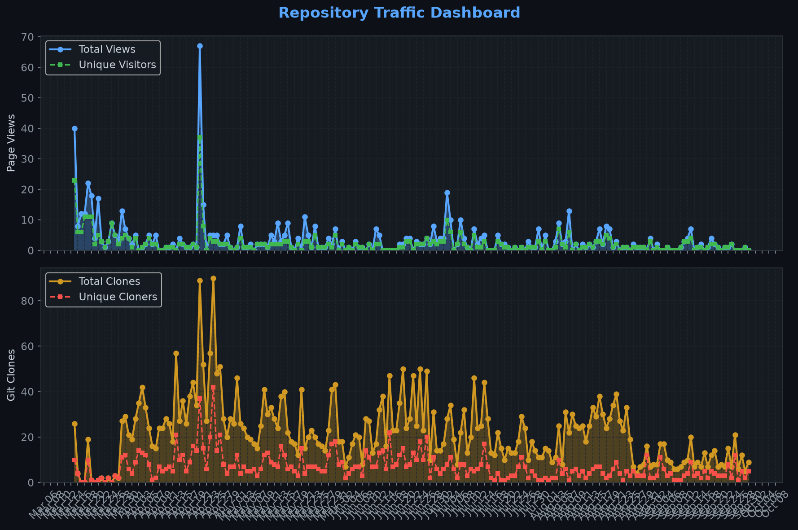
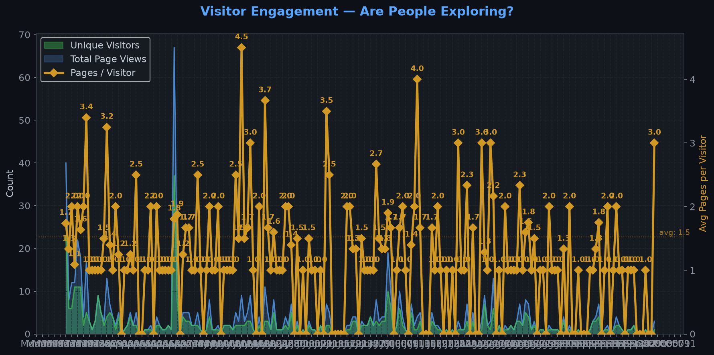
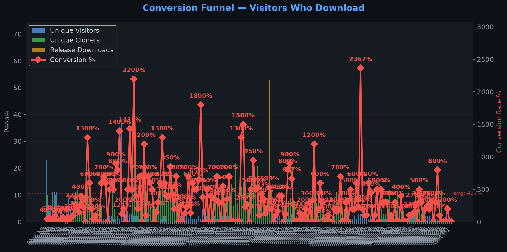
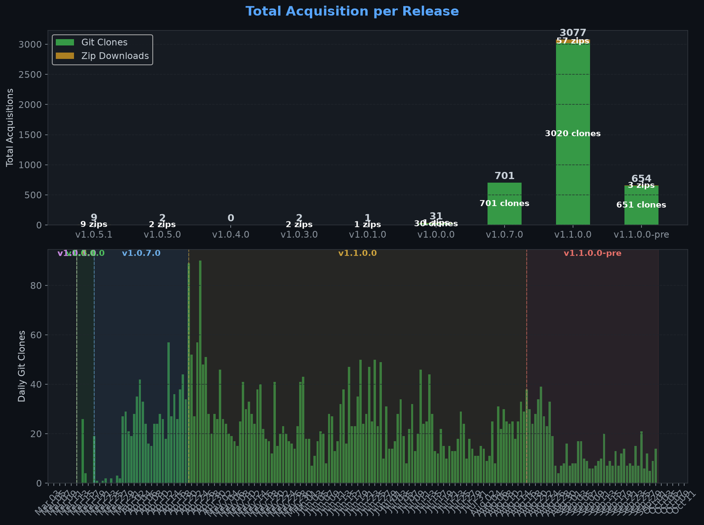
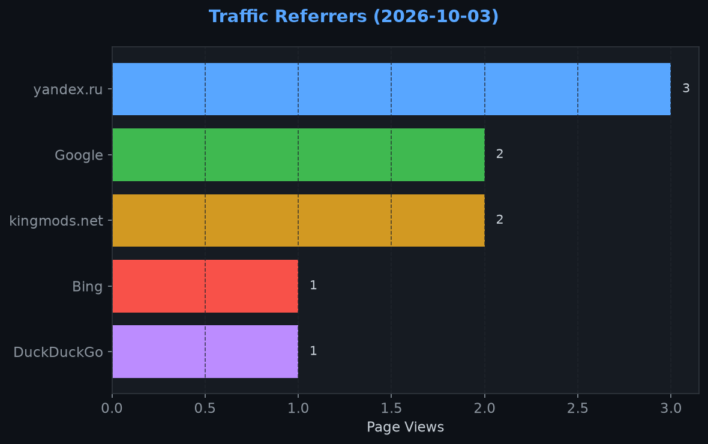
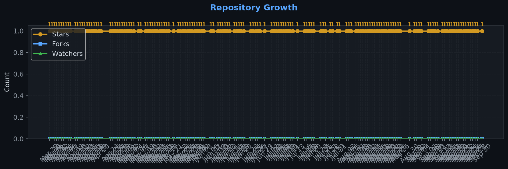

# Repository Traffic Dashboard

**Last updated:** 2026-10-04T18:58:41Z
**Days tracked:** 154 | **Download snapshots:** 334 (hourly)

---

## Views & Clones (14-day window, preserved forever)

| Metric | 14-Day Total | Unique |
|--------|-------------|--------|
| Page Views | 11 | 9 |
| Git Clones | 165 | 63 |

> **Engagement:** 1.2 pages per visitor (14-day avg)

---

## Visitor Engagement

> Higher = visitors exploring more pages. 1.0 = bounce. 3.0+ = deeply engaged.

---

## Conversion Funnel

> **14-day conversion:** 138 of 9 visitors cloned or downloaded (**1533.3%**)
>
> Unique cloners: 63 | Release downloads: 75

---

## Total Acquisition per Release (Downloads + Clones)

| Channel | Count |
|---------|-------|
| Zip Downloads | 75 |
| Git Clones (14-day) | 165 |
| **Total Acquisitions** | **240** |

---

## Referrers

| Source | Views | Unique |
|--------|-------|--------|
| kingmods.net | 2 | 1 |
| Bing | 1 | 1 |
| DuckDuckGo | 1 | 1 |
| Google | 1 | 1 |

---

## Repository Growth

| Metric | Current |
|--------|---------|
| Stars | 1 |
| Forks | 0 |
| Watchers | 0 |

---

## Top Pages (14-day)

| Page | Views | Unique |
|------|-------|--------|
| `/TheCodingDad-TisonK/FS25_CustomTriggerCreator` | 6 | 6 |
| `/TheCodingDad-TisonK/FS25_CustomTriggerCreator/releases/tag/v1.1.0.0` | 2 | 1 |
| `/TheCodingDad-TisonK/FS25_CustomTriggerCreator/blob/main/icon.dds` | 1 | 1 |
| `/TheCodingDad-TisonK/FS25_CustomTriggerCreator/issues/20` | 1 | 1 |
| `/TheCodingDad-TisonK/FS25_CustomTriggerCreator/issues/24` | 1 | 1 |

---

## Data Files

| File | Description | Granularity |
|------|-------------|-------------|
| [daily.json](daily.json) | Views & clones per day (never expires) | Daily |
| [downloads.json](downloads.json) | Release download snapshots | Hourly |
| [referrers.json](referrers.json) | Referrer snapshots | Daily |
| [metadata.json](metadata.json) | Stars, forks, watchers | Daily |
| [stats.json](stats.json) | Combined legacy snapshots | 6-hourly |

---
*Hourly download tracking + full dashboard with engagement metrics every 6 hours*
*Auto-generated by [traffic-stats.yml](../../.github/workflows/traffic-stats.yml)*
