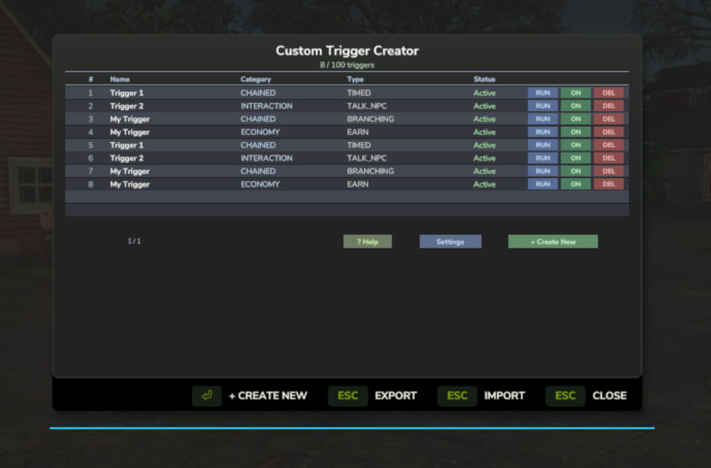
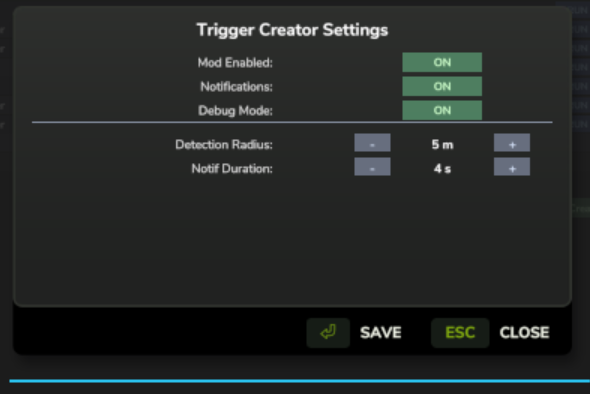

<div align="center">

# FS25 Custom Trigger Creator

### Build triggers inside the game. No XML. No Lua. Just press F8.

[](https://github.com/TheCodingDad-TisonK/FS25_CustomTriggerCreator/releases)
[](https://github.com/TheCodingDad-TisonK/FS25_CustomTriggerCreator/releases/latest)
[](LICENSE)
[](#)

<br>



*The management panel — 8 triggers active, each with live status, RUN / Toggle / Delete controls*

<br>

</div>

---

## What is this?

FS25 triggers normally live inside XML files and Lua scripts — invisible to most players. **Custom Trigger Creator** brings the whole system in-game through a guided wizard. Pick a category, configure it step by step, name it, place it. Done. No files to edit, no game restarts.

Every trigger saves to your savegame, persists across sessions, and can be exported and shared.

<br>

---

## Quick start

```
1  Press F8 to open the Trigger Creator
2  Click + Create New
3  Choose a category → choose a type → follow the wizard
4  Hit Create Trigger on the review screen
5  Your trigger appears in the list — press RUN to test it immediately
6  Toggle or delete any trigger at any time
7  Export to back up your whole collection
```

> **Tip** — Start with a **Notification → Info** trigger to get comfortable with the wizard before building anything more complex.

<br>

---

## Trigger categories

| Category | Types | What it does |
|---|---|---|
| **Economy** | Buy/Sell · Pay Fee · Earn · Barter | Money in, money out — tied to your farm balance |
| **Interaction** | Talk NPC · Receive Item · Fire Event · Animation | Player conversations, item handouts, external events |
| **Notification** | Info · Success · Warning · Error | Instant HUD toast in the top-right corner |
| **Conditional** | Time Check · Money Check · Random · Item Check | Gate any trigger behind a condition |
| **Chained** | 2-Step · 3-Step · Branching · Timed | Multi-step flows with confirmations and countdowns |
| **Custom Script** | Lua Callback · Event Hook · Scheduled · Conditional CB | Admin-only — wire into your own Lua code |

<br>

---

## The wizard — 6 steps

Every trigger type walks through the same flow. Conditional triggers add one extra step for the gate config.

```
Step 1 — Pick a category
Step 2 — Pick a type within that category
Step 3 — Configure (amounts, messages, fill types, durations)
Step 4 — Conditions  (Conditional triggers only)
Step 5 — Advanced options: cooldown, repeat limit, confirmation prompt
Step 6 — Name your trigger
Step 7 — Review everything and confirm
```

<br>

---

## Management panel

Open with **F8** from anywhere on your farm.

<br>

<div align="center">

</div>

<br>

Each row shows the trigger name, category, type, and current status. Three action buttons per row:

| Button | What it does |
|---|---|
| **RUN** | Fire the trigger immediately — useful for testing without walking to it |
| **ON / OFF** | Enable or disable without deleting |
| **DEL** | Remove permanently |

The **Help** button opens a quick-reference guide to all trigger types.
The **Settings** button opens the settings panel.
**Export / Import** back up or restore your trigger collection to a file.

<br>

---

## Settings

<br>

<div align="center">

</div>

<br>

Access via the **Settings** button in the management panel.

| Setting | Default | Description |
|---|---|---|
| **Mod Enabled** | On | Master on/off switch |
| **Notifications** | On | Show HUD toast messages |
| **Debug Mode** | Off | Verbose `[CTC]` output to `log.txt` |
| **Detection Radius** | 5 m | How close you need to be to activate a world trigger |
| **Notif Duration** | 4 s | How long toast messages stay on screen |

<br>

---

## World triggers

Triggers that have a world position show up in the game world:

- A **3D marker icon** floats above the location so you can spot it at a distance
- A **`[T] Name`** label appears on screen as you approach
- A **map hotspot** marks the location on your minimap
- Walk into range and press **`[E]`** to activate

<br>

---

## HUD notifications

Top-right toast notifications with slide-in and fade-out. Up to 5 stacked at once.

| Level | Colour | When it fires |
|---|---|---|
| `INFO` | Blue | Neutral messages, processes starting |
| `SUCCESS` | Green | Action completed, reward paid |
| `WARNING` | Amber | Condition not met, insufficient funds |
| `ERROR` | Red | Trigger failed or blocked |

Timed chained triggers show a live countdown bar below the notification stack.

<br>

---

## Export & Import

**Export** writes `ctc_export.xml` to your savegame folder — contains every trigger you've built.
**Import** reads that file and merges any triggers not already registered.

Use it to back up your collection, restore after a wipe, or share setups with other players on the same server.

> Trigger data also saves automatically to `ctc_data.xml` in your savegame folder on every save. No manual action needed.

<br>

---

## Installation

**1.** Download `FS25_CustomTriggerCreator.zip` from the [latest release](https://github.com/TheCodingDad-TisonK/FS25_CustomTriggerCreator/releases/latest)

**2.** Drop the ZIP (do not extract) into your mods folder:

| Platform | Path |
|---|---|
| Windows | `%USERPROFILE%\Documents\My Games\FarmingSimulator2025\mods\` |
| macOS | `~/Library/Application Support/FarmingSimulator2025/mods/` |

**3.** Enable *Custom Trigger Creator* in the in-game mod manager

**4.** Load any career save and press **F8**

<br>

---

## Key bindings

| Key | Action |
|---|---|
| `F8` | Open / close the Trigger Creator |
| `E` | Activate a nearby world trigger |

<br>

---

## For mod developers

Wire your own Lua callbacks into `FIRE_EVENT` triggers — no hard dependency needed:

```lua
-- Safe to call from any mod — just check g_CTCSystem exists first
if g_CTCSystem then
    g_CTCSystem.scriptRegistry["myEventKey"] = function()
        -- Your logic here
    end
end
```

Any `FIRE_EVENT` trigger configured with `eventName = "myEventKey"` will call your function on activation. See [docs/developer-api.md](docs/developer-api.md) for the full API.

<br>

---

## Roadmap

| Version | Planned |
|---|---|
| **1.1** | Trigger edit — re-open the wizard on an existing trigger |
| **1.2** | Multiplayer registry sync |
| **1.3** | ITEM_CHECK — live inventory API integration |
| **1.4** | Trigger groups / folders for large collections |

<br>

---

## Contributing

Found a bug? [Open an issue](https://github.com/TheCodingDad-TisonK/FS25_CustomTriggerCreator/issues/new/choose) — the template will guide you.

Feature idea? Check the roadmap first, then [open a feature request](https://github.com/TheCodingDad-TisonK/FS25_CustomTriggerCreator/issues/new/choose).

Pull requests are welcome — read [CONTRIBUTING.md](CONTRIBUTING.md) before opening one.

<br>

---

## License

Licensed under **[CC BY-NC-ND 4.0](LICENSE)** — you may share this mod in its original form with attribution, but may not use it commercially or distribute modified versions.

**Author:** TisonK · **Version:** 1.0.5.0

<br>

---

<div align="center">

*Farming Simulator 25 is published by GIANTS Software. This is an independent fan creation, not affiliated with or endorsed by GIANTS Software.*

**Build the triggers your farm deserves.**

</div>
